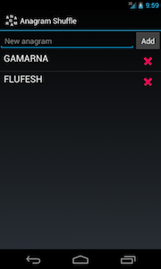
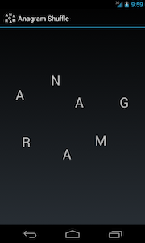

Anagram Shuffle
===============

When I switched from my iPhone to a Nexus 4, one of the apps I missed was dicwizard.jp's [Anagram](https://itunes.apple.com/us/app/anagram/id373719913?mt=8_).  It's not an anagram solver, or a word game (there are plenty of both of those), but a replacement for scribbling letters in random order on a piece of paper when you're trying to solve an anagram. I couldn't find anything similar in the Android Market, so I decided to write my own (even if that meant inflicting Java on myself again, for more-or-less the first time in five years).

The app is pretty simple &ndash; just enter the anagrams you're trying to solve, click on one, and drag the letters around the screen to your heart's content.

 

The current version is really little more than a spike (it has no tests, isn't particularly well-organised and probably doesn't use the Android API in the best way), but it seems to work. You can download [AnagramShuffle-1.0.apk](http://dl.dropbox.com/u/17259947/AnagramShuffle-1.0.apk) if you want to give it a try. Maybe when I've finished reading [Responsible Design for Android](https://leanpub.com/ResponsibleDesignAndroid-Part1) I'll rewrite it properly and upload it to Google Play, but don't hold your breath.

Licence
-------

Copyright (c) 2013, Kerry Buckley
All rights reserved.

Redistribution and use in source and binary forms, with or without modification, are permitted provided that the following conditions are met:

* Redistributions of source code must retain the above copyright notice, this list of conditions and the following disclaimer.
* Redistributions in binary form must reproduce the above copyright notice, this list of conditions and the following disclaimer in the documentation and/or other materials provided with the distribution.

THIS SOFTWARE IS PROVIDED BY THE COPYRIGHT HOLDERS AND CONTRIBUTORS "AS IS" AND ANY EXPRESS OR IMPLIED WARRANTIES, INCLUDING, BUT NOT LIMITED TO, THE IMPLIED WARRANTIES OF MERCHANTABILITY AND FITNESS FOR A PARTICULAR PURPOSE ARE DISCLAIMED. IN NO EVENT SHALL THE COPYRIGHT HOLDER OR CONTRIBUTORS BE LIABLE FOR ANY DIRECT, INDIRECT, INCIDENTAL, SPECIAL, EXEMPLARY, OR CONSEQUENTIAL DAMAGES (INCLUDING, BUT NOT LIMITED TO, PROCUREMENT OF SUBSTITUTE GOODS OR SERVICES; LOSS OF USE, DATA, OR PROFITS; OR BUSINESS INTERRUPTION) HOWEVER CAUSED AND ON ANY THEORY OF LIABILITY, WHETHER IN CONTRACT, STRICT LIABILITY, OR TORT (INCLUDING NEGLIGENCE OR OTHERWISE) ARISING IN ANY WAY OUT OF THE USE OF THIS SOFTWARE, EVEN IF ADVISED OF THE POSSIBILITY OF SUCH DAMAGE.
